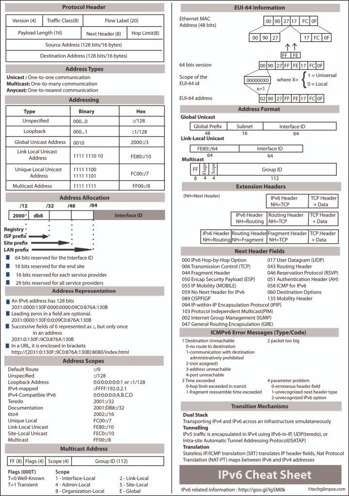
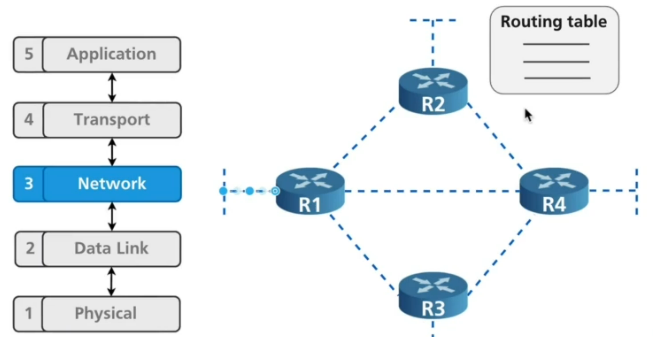
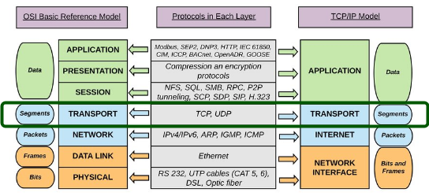
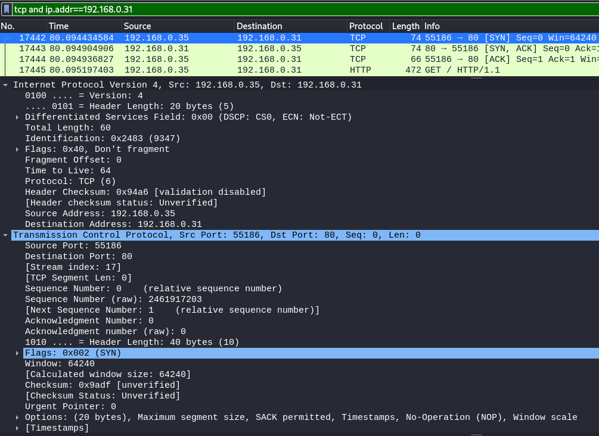
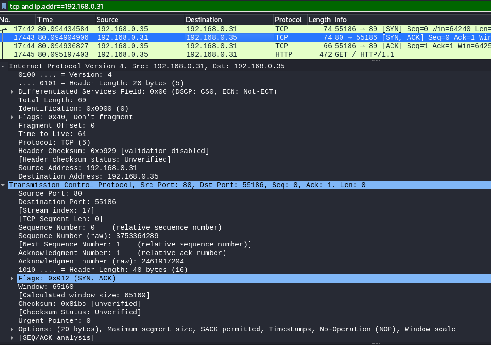
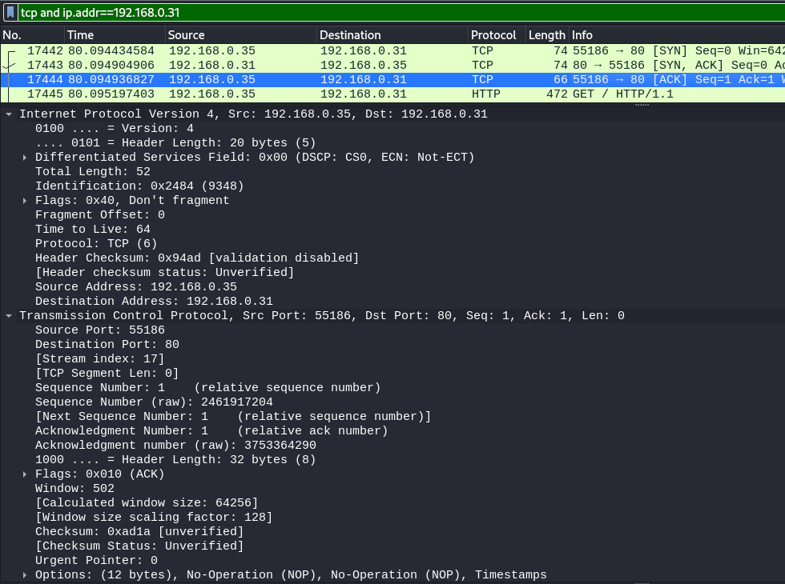
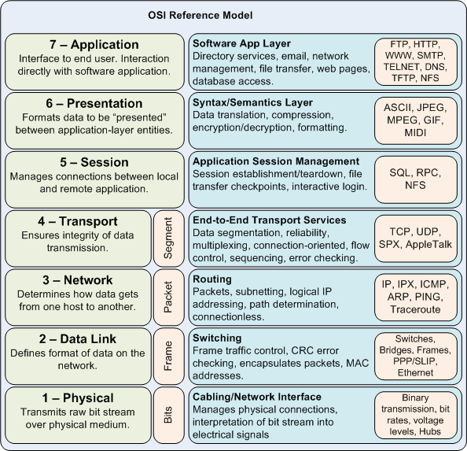
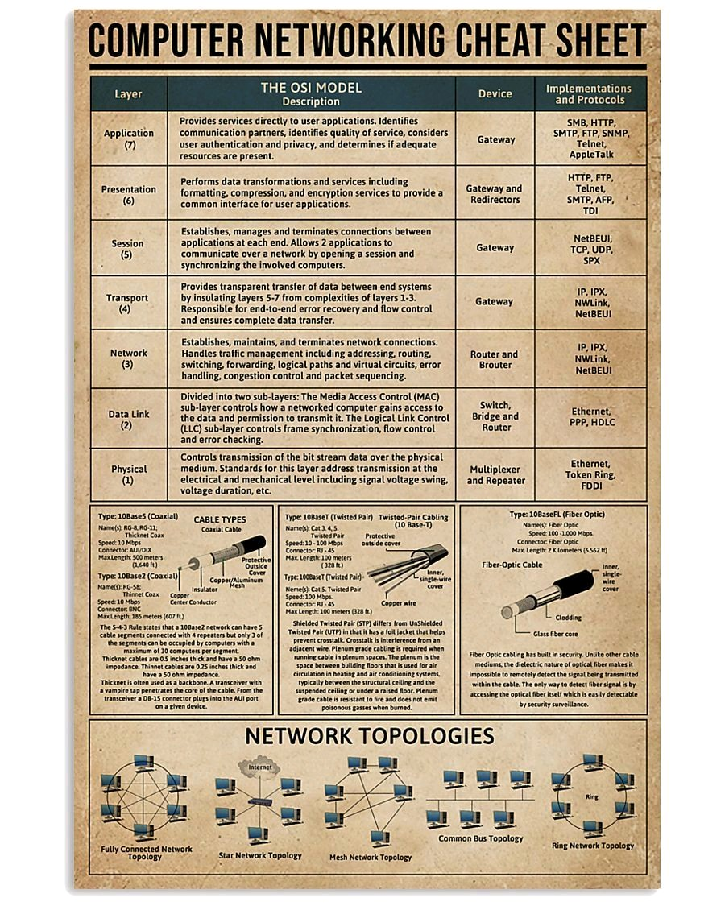

# CEH page 6 notes


# general info

## PDU SDU

The communication between layers higher than layer 1 is logical; the only hardware connection is at the physical layer. 

Encapsulation: in order for a protocol to communicate, it must pass down its PDU to the next lower layer for transmission. You've also already seen that, using OSI terminology, lower layers are said to provide services to the layers immediately above them. One of the services each layer provides is this function: to handle and manage data received from the layer above. At any particular layer N, a PDU is a complete message that implements the protocol at that layer. However, when this layer N PDU is passed down to layer N-1, it becomes the data that the layer N-1 protocol is supposed to service. Thus, the layer N protocol data unit (PDU) is called the layer N-1 service data unit (SDU). The job of layer N-1 is to transport this SDU, which it does by placing the layer N SDU into its own PDU format, preceding the SDU with its own headers and appending footers as necessary. This process is called data encapsulation, because the entire contents of the higher-layer message are encapsulated as the data payload of the message at the lower layer. What does layer N-1 do with its PDU? It passes it down to the next lower layer, where it is treated as a layer N-2 SDU. Layer N-2 creates a layer N-2 PDU containing the layer N-1 SDU and layer N-2's headers and footers. And so the process continues, all the way down to the physical layer. In the theoretical model, what you end up with is a message at layer 1 that consists of application-layer data that is encapsulated with headers and footers from layers 7 through 2.

Decapsulation (example): The Ethernet software inspects the layer 2 PDU (Ethernet frame) and removes from it the layer 2 SDU (IP datagram), which it passes up to IP as a layer 3 PDU. The IP layer removes the layer 3 SDU (TCP segment) and passes it to TCP as a layer 4 PDU. TCP continues the process, going back up the protocol layer stack.

# Layer 1


[https://www.mattkeeter.com/blog/2022-08-11-udp/](https://www.mattkeeter.com/blog/2022-08-11-udp/)


Physical Layer (Layer 1) [src](http://www.tcpipguide.com/free/t_PhysicalLayerLayer1.htm)

The lowest layer of the OSI Reference Model is layer 1, the physical layer; it is commonly abbreviated "PHY". The physical layer is special compared to the other layers of the model, because it is the only one where data is physically moved across the network interface. All of the other layers perform useful functions to create messages to be sent, but they must all be transmitted down the protocol stack to the physical layer, where they are actually sent out over the network.

Note: The physical layer is also "special" in that it is the only layer that really does not apply specifically to TCP/IP. Even in studying TCP/IP, however, it is still important to understand its significance and role in relation to the other layers where TCP/IP protocols reside.

Understanding the Role of the Physical Layer

The name "physical layer" can be a bit problematic. Because of that name, and because of what I just said about the physical layer actually transmitting data, many people who study networking get the impression that the physical layer is only about actual network hardware. Some people may say the physical layer is "the network interface cards and cables". This is not actually the case, however. The physical layer defines a number of network functions, not just hardware cables and cards.

A related notion is that "all network hardware belongs to the physical layer". Again, this isn't strictly accurate. All hardware must have some relation to the physical layer in order to send data over the network, but hardware devices generally implement multiple layers of the OSI model, including the physical layer but also others. For example, an Ethernet network interface card performs functions at both the physical layer and the data link layer.
Physical Layer Functions

The following are the main responsibilities of the physical layer in the OSI Reference Model:

## Definition of Hardware Specifications
The details of operation of cables, connectors, wireless radio transceivers, network interface cards and other hardware devices are generally a function of the physical layer (although also partially the data link layer; see below).

## Encoding and Signaling
The physical layer is responsible for various encoding and signaling functions that transform the data from bits that reside within a computer or other device into signals that can be sent over the network.

## Data Transmission and Reception
After encoding the data appropriately, the physical layer actually transmits the data, and of course, receives it. Note that this applies equally to wired and wireless networks, even if there is no tangible cable in a wireless network!

## Topology and Physical Network Design
The physical layer is also considered the domain of many hardware-related network design issues, such as LAN and WAN topology. 

In general, then, physical layer technologies are ones that are at the very lowest level and deal with the actual ones and zeroes that are sent over the network. For example, when considering network interconnection devices, the simplest ones operate at the physical layer: repeaters, conventional hubs and transceivers. These devices have absolutely no knowledge of the contents of a message. They just take input bits and send them as output. Devices like switches and routers operate at higher layers and look at the data they receive as being more than voltage or light pulses that represent one or zero.

## Relationship Between the Physical Layer and Data Link Layer
It's important to point out that while the physical layer of a network technology primarily defines the hardware it uses, the physical layer is closely related to the data link layer. Thus, it is not generally possible to define hardware at the physical layer "independently" of the technology being used at the data link layer. For example, Ethernet is a technology that describes specific types of cables and network hardware, but the physical layer of Ethernet can only be isolated from its data link layer aspects to a point. While Ethernet cables are "physical layer", for example, their maximum length is related closely to message format rules that exist at the data link layer.

Furthermore, some technologies perform functions at the physical layer that are normally more closely associated with the data link layer. For example, it is common to have the physical layer perform low-level (bit level) repackaging of data link layer frames for transmission. Error detection and correction may also be done at layer 1 in some cases. Most people would consider these "layer two functions".

In many technologies, a number of physical layers can be used with a data link layer. Again here, the classic example is Ethernet, where dozens of different physical layer implementations exist, each of which uses the same data link layer (possibly with slight variations.)

## Physical Layer Sublayers
Finally, many technologies further subdivide the physical layer into sublayers. In order to increase performance, physical layer encoding and transmission methods have become more complex over time. The physical layer may be broken into layers to allow different network media to be supported by the same technology, while sharing other functions at the physical layer that are common between the various media. A good example of this is the physical layer architecture used for Fast Ethernet, Gigabit Ethernet and 10-Gigabit Ethernet.

# Layer 2

A layer 2 network is a broadcast domain (LAN or Wireless LAN WLAN). 

The gray area between LAN and WAN is becoming more muddled every year: Wide Area Networks (WANs) are not layer 2. More often than not, WANs are used to link physically distant LANs. Networks are often divided by size and general communication method into three classes. Local area networks (LANs) generally connect proximate devices, usually using cables. Wireless LANs (WLANs) are like cabled LANs but use radio frequency or light technology to connect devices without wires. Wide area networks (WANs) connect distant devices or LANs to each other. Campus area networks (CANs) and metropolitan area networks (MANs) fall between LANs and WANs in terms of overall size. Personal area networks (PANs) are like very small LANs and often appear as wireless PANs WPANs. IEEE 802.16 is an example of a WMAN standard. The term PAN is most commonly used in reference to Bluetooth/IEEE 802.15 wireless technology, so you will sometimes see the terms wireless PAN (WPAN) and PAN used interchangeably.


The second-lowest layer (layer 2) in the OSI Reference Model stack is the data link layer, often abbreviated "DLL" (though that abbreviation has other meanings as well in the computer world). The data link layer, also sometimes just called the link layer, is where many wired and wireless local area networking (LAN) technologies primarily function. For example, Ethernet, Token Ring, FDDI and 802.11 ("wireless Ethernet" or "Wi-Fi’) are all sometimes called "data link layer technologies". The set of devices connected at the data link layer is what is commonly considered a simple "network", as opposed to an internetwork.
Data Link Layer Sublayers: Logical Link Control (LLC) and Media Access Control (MAC)

The data link layer is often conceptually divided into two sublayers: logical link control (LLC) and media access control (MAC). This split is based on the architecture used in the IEEE 802 Project, which is the IEEE working group responsible for creating the standards that define many networking technologies (including all of the ones I mentioned above except FDDI). By separating LLC and MAC functions, interoperability of different network technologies is made easier, as explained in our earlier discussion of networking model concepts.
Data Link Layer Functions

The following are the key tasks performed at the data link layer:

## Logical Link Control (LLC)
Logical link control refers to the functions required for the establishment and control of logical links between local devices on a network. As mentioned above, this is usually considered a DLL sublayer; it provides services to the network layer above it and hides the rest of the details of the data link layer to allow different technologies to work seamlessly with the higher layers. Most local area networking technologies use the IEEE 802.2 LLC protocol.

## Media Access Control (MAC)
This refers to the procedures used by devices to control access to the network medium. Since many networks use a shared medium (such as a single network cable, or a series of cables that are electrically connected into a single virtual medium) it is necessary to have rules for managing the medium to avoid conflicts. For example. Ethernet uses the CSMA/CD method of media access control, while Token Ring uses token passing.

## Data Framing
The data link layer is responsible for the final encapsulation of higher-level messages into frames that are sent over the network at the physical layer.

## Addressing
The data link layer is the lowest layer in the OSI model that is concerned with addressing: labeling information with a particular destination location. Each device on a network has a unique number, usually called a hardware address or MAC address, that is used by the data link layer protocol to ensure that data intended for a specific machine gets to it properly.

## Error Detection and Handling
The data link layer handles errors that occur at the lower levels of the network stack. For example, a cyclic redundancy check (CRC) field is often employed to allow the station receiving data to detect if it was received correctly. 

## Physical Layer Requirements Definition and Network Interconnection Device Layers

As I mentioned in the topic discussing the physical layer, that layer and the data link layer are very closely related. The requirements for the physical layer of a network are often part of the data link layer definition of a particular technology. Certain physical layer hardware and encoding aspects are specified by the DLL technology being used. The best example of this is the Ethernet standard, IEEE 802.3, which specifies not just how Ethernet works at the data link layer, but also its various physical layers.

Since the data link layer and physical layer are so closely related, many types of hardware are associated with the data link layer. Network interface cards (NICs) typically implement a specific data link layer technology, so they are often called "Ethernet cards", "Token Ring cards", and so on. There are also a number of network interconnection devices that are said to "operate at layer 2", in whole or in part, because they make decisions about what to do with data they receive by looking at data link layer frames. These devices include most bridges, switches and barters, though the latter two also encompass functions performed by layer three.

Some of the most popular technologies and protocols generally associated with layer 2 are Ethernet, Token Ring, FDDI (plus CDDI), HomePNA, IEEE 802.11, ATM, and TCP/IP's Serial Link Interface Protocol (SLIP) and Point-To-Point Protocol (PPP).

Key Concept: The second OSI Reference Model layer is the data link layer. This is the place where most LAN and wireless LAN technologies are defined. Layer two is responsible for logical link control, media access control, hardware addressing, error detection and handling, and defining physical layer standards. It is often divided into the logical link control (LLC) and media access control (MAC) sublayers, based on the IEEE 802 Project that uses that architecture.


A switched point-to-point connection between two communicating devices can be considered a "channel" [src](https://www.liveaction.com/resources/glossary/gigabit-ethernet-and-fibre-channel-technology/)


[https://www.ciscopress.com/articles/article.asp?p=2348265&seqNum=2](https://www.ciscopress.com/articles/article.asp?p=2348265&seqNum=2) (use of the word "campus" in cisco articles: "The campus local area network (LAN) is the network that supports devices people use within a location to connect to information. The use of the word campus does not imply any specific geographic size or organizational boundary—the campus LAN can range in size from a single switch at a small remote site up to a large multi-building infrastructure, supporting classrooms, carpeted office space, and similar places where people use their devices for their daily activities. The campus design incorporates both wired LAN and wireless LAN connectivity for a complete network access solution.")

Ethernet frame format is defined by the IEEE 802.3 standard: 
[https://fr.wikipedia.org/wiki/IEEE_802.3](https://fr.wikipedia.org/wiki/IEEE_802.3)

Wikipedia: 
[https://en.wikipedia.org/wiki/Ethernet_frame](https://en.wikipedia.org/wiki/Ethernet_frame)

## Example using [scapy](https://github.com/secdev/scapy/)

`ifconfig -a` provides own MAC address.

`sudo nmap -sS 192.168.0/24` also returns the MAC addresses .TCP SYN (Stealth) Scan (-sS) is the default TCP scan when run as root [nmap book](https://nmap.org/book/synscan.html)


On kali:
```
sudo ./run_scapy 
x = Ether(src='d8:cb:8a:84:06:8c', dst='b8:27:eb:13:dc:9f')
ls(x)
sendp(x, iface='eth0')
```

On rapsberry pi...
tcpdump documentation:
```
-e     Print the link-level header on each dump line.  This can be used, for example, to print MAC layer addresses for protocols such as Ethernet and IEEE 802.11
-n     Don't convert addresses (i.e., host addresses, port numbers, etc.) to names.
-i interface
```
tcpdump supports the "ether" qualifier to specify ethernet addresses in the standard colon-separated format. To capture any traffic sent to or from a given MAC address :
```
tcpdump ether host e8:2a:ea:44:55:66
```
Thus we capture the frame using this command:
```
sudo tcpdump -eni eth0 ether host d8:cb:8a:84:06:8c > tcpdump.txt
```
shows:
```
12:02:24.022056 d8:cb:8a:84:06:8c > b8:27:eb:13:dc:9f, ethertype Loopback (0x9000), length 60: Loopback, skipCount 0,  invalid (0)
```


## Ethernet frame


### preamble

binary value:
```
10101010 10101010 10101010 10101010 10101010 10101010 10101010
AA AA AA AA AA AA AA
```

There is no preamble in the fields shown in Wireshark. The preamble is a physical layer mechanism to help the NIC identify the start of a frame. It carries no useful data and is not received like other fields.

### Start Frame Delimiter
```
10101011
AB
```

### destination MAC address

Some switches operate on Fast-Forward mode. They can look into their MAC address table and start forwarding frames as soon as they get the destination MAC address.

[https://www.networkacademy.io/ccna/ethernet/store-and-forward-vs-cut-through-switching](https://www.networkacademy.io/ccna/ethernet/store-and-forward-vs-cut-through-switching)

"When a switch receives in store-n-forward mode, the frame is checked for errors, and frames with a valid cyclic redundancy check (CRC) are regenerated and transmitted. Some models of switches, mostly Nexus switches, opt to switch frames based only on reading the Layer 2 information and bypassing the CRC check. This bypass, referred to as cut-through switching, lowers the latency of the frame transmission as the entire frame is not stored before transmission to another port. Lower switching latency is beneficial for low-latency applications such as algorithm trading programs found in the data center. The assumption is that the end device network interface card (NIC) or an upper-level protocol will eventually discard the bad frame. Most Catalyst switches are store-n-forward." [https://www.ciscopress.com/articles/article.asp?p=2348265&seqNum=2](https://www.ciscopress.com/articles/article.asp?p=2348265&seqNum=2)

> "Fast-Forward mode" = "cut-through switching" (CISCO)

### source MAC address 

### VLAN tag

[https://fr.wikipedia.org/wiki/IEEE_802.1Q](https://fr.wikipedia.org/wiki/IEEE_802.1Q)

Switches associate each port with a vlan id (Port VLAN Identifier). Switches are responsible for creation and management of VLANs.
Default is PVID 1.
Switches can handle multiple VLANs.
[https://www.youtube.com/watch?v=vE5gvbmR8jg](https://www.youtube.com/watch?v=vE5gvbmR8jg)

* Trunk = 802.1q link, adds VLAN ID (VLAN tag) to frames traversing switches.
* trunking = passing different VLAN frames over the trunk
* Trunk port (CISCO term) = tagged port, port that adds the VLAN tag to ethernet frames
* Access port (CISCO) = untagged port, switch port that sends and expects to receive frames without VLAN tag. An access port carries traffic for a single VLAN.
* Switches remove the VLAN tag before deleivering frames to destination.


*Tag protocol identifier, TPID, Ethernet type* : 16 bits, always `0x8100` (4-digit hexadecimal integer. could have been 0xFFFF) for th VLAN tag (802.1Q Tag)

*Tag control information* contains *Priority (3 bits)*,	*CFI (1 bit)*, and *Vlan ID, VID (12 bits)*

*PCP : Priority Code Point* Different PCP values can be used to prioritize different classes of traffic

*Drop eligible indicator (DEI)*  indicates frames eligible to be dropped in the presence of congestion

*VLAN identifier (VID)* specifies the VLAN to which the frame belongs

[https://www.nojitter.com/qos-layer-2](https://www.nojitter.com/qos-layer-2)

 "VLANs are a way to logically separate traffic in a switched (Layer 2) infrastructure. Packets traversing the LAN are given an extra tag field that identifies the VLAN to which they belong. Switches will then only forward those packets to ports that belong to that VLAN. This keeps each VLAN's traffic separated as if they were on a separate physical infrastructure.

But does it really? From a forwarding point of view, yes. But from a timing point of view it does not. The data and real-time packets are still using the same trunk links, the same switches and (most importantly) the same output queues. So if a big data transfer is occuring concurrent with our real-time stream, the real-time packets can end up waiting in that output queue for the data packets that are ahead of it. Yes they are destined for separate destinations, yes they are logically separated, but they are still waiting in line together.

So to get the QoS behavior we need, which means getting those real-time packets to the head of their own queue, and then giving that queue priority, we have to implement IEEE 802.1p as well. This priority mechanism was defined by the IEEE about 10 years ago in conjunction with IEEE 802.1Q, and the two standards use the same header referred to above. The priority component defines one of eight priorities for the packet, while the VLAN component defines to which VLAN this packet belongs. If your switches are less than 10 years old they likely have this capability and it just needs to be enabled.

In many switches the priority of the VLAN can be defined in the switch itself, so it is possible to mark packets at the edge with just the VLAN identifier, and then configure the switches to ensure that all packets from that VLAN are given priority when passing through the switch. The switch implements additional queues at each output port to support the higher priority traffic, and typically uses a simple priority mechanism. This means traffic in the higher priority queue is forwarded before any traffic in a lower priority queue."

### EtherType

[https://en.wikipedia.org/wiki/EtherType](https://en.wikipedia.org/wiki/EtherType)
EtherType is a two-octet field in an Ethernet frame. It is used to indicate which protocol is encapsulated in the payload of the frame and is used at the receiving end by the data link layer to determine how the payload is processed.
[https://en.wikipedia.org/wiki/EtherType#Values](https://en.wikipedia.org/wiki/EtherType#Values)

Layer 2 header carries information about the layer 3 :
* `0x0800` corresponds to "IPv4"
* `0x0806` corresponds to "ARP"

### Data

Data is the content created by upper layers of the TCP/IP stack (including network layer, transport layer...)
The maximum size of frames is called the Maximum Transmission Unit (MTU).
The maximum payload in 802.3 ethernet is 1500 bytes. MTU is 1500 bytes.

### CRC (FCS)

Cyclic Redundancy Check (Frame Check Sequence)

## ARP


[ARP](https://en.wikipedia.org/wiki/Address_Resolution_Protocol) is not IP. ARP is layer 2.

* "Computer 1 uses a cached ARP table to look up 192.168.0.55 for any existing records of Computer 2's MAC address
* If the cache did not produce a result, computer 1 has to send a broadcast ARP request message (destination FF:FF:FF:FF:FF:FF MAC address), which is accepted by all computers on the local network, requesting an answer for 192.168.0.55.
* Computer 2 responds with an ARP response message containing its MAC and IP addresses. As part of fielding the request, Computer 2 may insert an entry for Computer 1 into its ARP table for future use.
* Computer 1 receives and caches the response information in its ARP table and can now send the packet"

"ARP packets are not routable nor do they have IP headers. ARP is a broadcast frame that is sent on a layer 2 segment. ARP has no protocol number and has type `0x806`, which all lends itself to L2.
Ultimately ARP operates only at L2 but provides services to L3." [src](https://gregsowell.com/?p=2987)

One could say that ARP provides services to L2: if computer 1 has to send a frame to computer 2, then computer 1 needs computer 2 MAC address.

scapy:
* psrc is Sender protocol address (SPA)
* pdst is Target protocol address (TPA)
* hwsrc is Target hardware address (THA)
[https://en.wikipedia.org/wiki/Address_Resolution_Protocol](https://en.wikipedia.org/wiki/Address_Resolution_Protocol)


this sends ARP request to broadcast MAC address:
```
result = sr1(ARP(op="who-has", psrc="192.168.0.35", pdst="192.168.0.31"))
```


`result` returns the correct MAC address `b8:27:eb:13:dc:9f`:
```
<ARP  hwtype=0x1 ptype=IPv4 hwlen=6 plen=4 op=is-at hwsrc=b8:27:eb:13:dc:9f psrc=192.168.0.31 hwdst=d8:cb:8a:84:06:8c pdst=192.168.0.35 |<Padding  load='\x00\x00\x00\x00\x00\x00\x00\x00\x00\x00\x00\x00\x00\x00\x00\x00\x00\x00' |>>
```


A host will send a ARP request only to query IP address from the same network.
For example, no broadcast ARP request will be sent to query Google DNS server 8.8.8.8.
For any IP address not in the LAN, hosts use the MAC address of the default gateway. In above example:
* 192.168.0.22
* 00:24:d4:79:ae:06

How to read ARP cache?

on Windows:
* `arp -a`

on Unix:
* `arp -n`


How to remove entry from cache?

on Windows, flush all ARP cache:
* `arp -d`

on Unix, remove specific entry:
* `sudo arp -d << ip >>`

### ARP cache poisoning and MITM

[https://medium.datadriveninvestor.com/arp-cache-poisoning-using-scapy-d6711ecbe112](https://medium.datadriveninvestor.com/arp-cache-poisoning-using-scapy-d6711ecbe112)

[https://www.ettercap-project.org/](https://www.ettercap-project.org/)

[https://www.hackers-arise.com/post/2017/08/28/mitm-attack-with-ettercap](https://www.hackers-arise.com/post/2017/08/28/mitm-attack-with-ettercap)

# Layer 3

An internetwork is formed when these layer 2 networks are linked together at layer 3, using routers that pass IP datagrams between networks.


[src](http://www.tcpipguide.com/free/t_NetworkLayerLayer3.htm)

The third-lowest layer of the OSI Reference Model is the network layer. If the data link layer is the one that basically defines the boundaries of what is considered a network, the network layer is the one that defines how internetworks (interconnected networks) function. The network layer is the lowest one in the OSI model that is concerned with actually getting data from one computer to another even if it is on a remote network; in contrast, the data link layer only deals with devices that are local to each other.

While all of layers 2 through 6 in the OSI Reference Model serve to act as "fences" between the layers below them and the layers above them, the network layer is particularly important in this regard. It is at this layer that the transition really begins from the more abstract functions of the higher layers—which don't concern themselves as much with data delivery—into the specific tasks required to get data to its destination. The transport layer, which is related to the network layer in a number of ways, continues this "abstraction transition" as you go up the OSI protocol stack.
Network Layer Functions

Some of the specific jobs normally performed by the network layer include:

## Logical Addressing
Logical Addressing: Every device that communicates over a network has associated with it a logical address, sometimes called a layer three address. For example, on the Internet, the Internet Protocol (IP) is the network layer protocol and every machine has an IP address. Note that addressing is done at the data link layer as well, but those addresses refer to local physical devices. In contrast, logical addresses are independent of particular hardware and must be unique across an entire internetwork.

## Routing
Routing: Moving data across a series of interconnected networks is probably the defining function of the network layer. It is the job of the devices and software routines that function at the network layer to handle incoming packets from various sources, determine their final destination, and then figure out where they need to be sent to get them where they are supposed to go. I discuss routing in the OSI model more completely in this topic on the topic on indirect device connection, and show how it works by way of an OSI model analogy.

## Datagram Encapsulation
Datagram Encapsulation: The network layer normally encapsulates messages received from higher layers by placing them into datagrams (also called packets) with a network layer header.

## Fragmentation and Reassembly
Fragmentation and Reassembly: The network layer must send messages down to the data link layer for transmission. Some data link layer technologies have limits on the length of any message that can be sent. If the packet that the network layer wants to send is too large, the network layer must split the packet up, send each piece to the data link layer, and then have pieces reassembled once they arrive at the network layer on the destination machine. A good example is how this is done by the Internet Protocol.

## Error Handling and Diagnostics
Error Handling and Diagnostics: Special protocols are used at the network layer to allow devices that are logically connected, or that are trying to route traffic, to exchange information about the status of hosts on the network or the devices themselves. 

## Network Layer Connection-Oriented and Connectionless Services
Network layer protocols may offer either connection-oriented or connectionless services for delivering packets across the network. Connectionless ones are by far more common at the network layer. In many protocol suites, the network layer protocol is connectionless, and connection-oriented services are provided by the transport layer. For example, in TCP/IP, the Internet Protocol (IP) is connectionless, while the layer four Transmission Control Protocol (TCP) is connection-oriented.

The most common network layer protocol is of course the Internet Protocol (IP), which is why I have already mentioned it a couple of times. IP is the backbone of the Internet, and the foundation of the entire TCP/IP protocol suite. There are also several protocols directly related to IP that work with it at the network layer, such as IPsec, IP NAT and Mobile IP. ICMP is the main error-handling and control protocol that is used along with IP. Another notable network layer protocol outside the TCP/IP world is the Novell IPX protocol.

Key Concept: The OSI Reference Model’s third layer is called the network layer. This is one of the most important layers in the model; it is responsible for the tasks that link together individual networks into internetworks. Network layer functions include internetwork-level addressing, routing, datagram encapsulation, fragmentation and reassembly, and certain types of error handling and diagnostics. The network layer and transport layer are closely related to each other.

The network interconnection devices that operate at the network layer are usually called routers, which at this point should hopefully come as no surprise to you. They are responsible for the routing functions I have mentioned, by taking packets received as they are sent along each "hop" of a route and sending them on the next leg of their trip. They communicate with each other using routing protocols, to determine the best routes for sending traffic efficiently. So-called "brouters" also reside at least in part at the network layer, as do the rather obviously named "layer three switches". J

## IP V4


Does class A IP adresses include 0.* and 127.* ?
* A, 1.0.0.0 - 126.255.255.255, 0XXXXXXX, 255.0.0.0
* B, 128.0.0.0 - 191.255.255.255, 10XXXXXX, 255.255.0.0
* C, 192.0.0.0 - 223.255.255.255, 110XXXXX, 255.255.255.0
* ...

All devices from the same switched network (L2) must have IP addresses from the same network. 
Every IP address that belongs to a network has:
* a network part
* a host part
Parts are defined by the network mask

A layer 3 network is a set of devices that can talk to each other without going through a gateway.

### private IP addresses ranges

* 1 class A network, 10.0.0.0 - 10.255.255.255, (starting from 10.0.0.0/8 network)
* 16 class B networks, 172.16.0.0 - 172.31.255.255, (starting from 172.16.0.0/16 network)
* 256 class C networks, 192.168.0.0 - 192.168.255.255, (starting from 192.168.0.0/24 network)

### header


[https://en.wikipedia.org/wiki/IPv4#Header](https://en.wikipedia.org/wiki/IPv4#Header)

*packet splitting*

IPV4 packet size is [20, 65 535] bytes.
But ethernet frames MTU is 1500 bytes.
When a router receives a packet, it examines the destination address and determines the outgoing interface to use and that interface's MTU. If the packet size is bigger than the MTU, then the router fragments the packet.
Large packets are splitted into smaller packets.
[https://en.wikipedia.org/wiki/IPv4#Fragmentation_and_reassembly](https://en.wikipedia.org/wiki/IPv4#Fragmentation_and_reassembly)

"If 2000-byte Ethernet packets arrive at a router, it will split their payloads in two and repackage them into two packets that are each smaller than 1500 bytes and so meet the MTU.
An alternative is that the router drops the packet but sends the source device an internet control-message protocol (ICMP) packet-too-big message. The intent is for the source device resend the payload in smaller packets, but it might not be configured to support this."

"IP specifies that an ICMP error message type 3 (destination unreachable) code 4 (Fragmentation Required but DF Bit Is Set) is sent to the originating host at the point where the fragmentation would have occurred"

*The fragment offset field* specifies the offset of a particular fragment relative to the beginning of the original unfragmented IP datagram in units of eight-byte blocks. The first fragment has an offset of zero. The 13 bit field allows a maximum offset of (2^13 – 1) × 8 = 65,528 bytes, which, with the header length included (65,528 + 20 = 65,548 bytes), supports fragmentation of packets exceeding the maximum IP length of 65,535 bytes.

*Version*
"4" for IPV4

*IHL*
Internet Header Length. Minimum length is 160bits (if no options).

*DSCP*
Differentiated Service Code Point. Used to prioritize packets. "The definition of ToS was changed entirely in RFC 2474, and it is now called Differentiated Service (DS). On the eight fields (DSCP and ECN), the upper six bit contain value called Differentiated Services Code Point (DSCP)" [https://blogs.manageengine.com/network/netflowanalyzer/2012/04/24/understanding-ip-precedence-tos-dscp.html](https://blogs.manageengine.com/network/netflowanalyzer/2012/04/24/understanding-ip-precedence-tos-dscp.html) & [https://en.wikipedia.org/wiki/Type_of_service](https://en.wikipedia.org/wiki/Type_of_service)

*ECN*
Explicit Congestion Notification. End-to-end notification of network congestion without dropping packets. 

*Total length* of entire IPV4 packet. From 20 bytes (only minimal header) to 65 535 bytes (maximum packet size)

*Identification*, *flag* and *fragment offset* are used for a common purpose: packet splitting. They are used by the receiver to gather all fragments of the packet.s
Packets may be splitted into *fragments*, each of them being part of the same original packet.
*indentification* field contains the unique identifier of the packet, same in all fragments. 
The *flag* field says wether the packet was fragmented or not.
The *fragment offset* field is the sequence number of each fragment (starting with 0).

*TTL* prevents infinite routing loops. Each router decrements TTL field by 1.

The *protocol* field defines the protocol used in the data portion of the IP datagram.
This can be any of [those values](https://en.wikipedia.org/wiki/List_of_IP_protocol_numbers)
For example `0x06` corresponds to TCP. 
This means that this layer 3 header carries information about the layer 4.

*Header checksum* is not the checksum of the full packet (or fragment). But only the header checksum.
Every router decrements the TTL thus recalculates the header checksum.

*Source IPV4 address*

*Destination IPV4 address*

## IP v6



## ICMP

Internet Control Message Protocol
```
p = IP(dst="8.8.8.8")/ICMP()
r = sr1(p)
```
Request:


Destination MAC address in Ethernet frame is the MAC Address of the LAN default gateway `e4:9e:12:77:aa:85`.
The router will change this MAC address, during processing by the WAN interface. It will replace the destination MAC address with the next hop router's MAC address.

Response:


ICMP requires the IP header, because ICMP packets may be routed to different networks

## Gateway vs router

[https://www.router-switch.com/faq/gateway-router-difference.html](https://www.router-switch.com/faq/gateway-router-difference.html)

Any host in any network knows its default router or default gateway. ()

## routing

[https://www.cisco.com/c/en/us/products/routers/4000-series-integrated-services-routers-isr/index.html](https://www.cisco.com/c/en/us/products/routers/4000-series-integrated-services-routers-isr/index.html)




Parenthèse OSPF [https://www.it-connect.fr/chapitres/les-zones-ospf/](https://www.it-connect.fr/chapitres/les-zones-ospf/)

## Layer 3 (Multilayer) Switch Operation

[https://www.nojitter.com/qos-layer-2](https://www.nojitter.com/qos-layer-2)

"Some switches will also recognize the Layer 3 header QoS markings (the TOS or DSCP bits), and then put those packets into the appropriate queue. This is a good option if it is supported by your hardware and if your enterprise has not chosen to implement VLANs. If each switch on the path will provide priority by watching the Layer 3 tags, then priority can be provided without using the extra Layer 2 header required for IEEE 802.1p/Q.

No matter which approach you take, don't ignore QoS at Layer 2. The sporadic problems that occur when voice or video is not being carried by QoS will drive the IT team mad trying to find and isolate them later. "

[https://www.ciscopress.com/articles/article.asp?p=2348265&seqNum=2](https://www.ciscopress.com/articles/article.asp?p=2348265&seqNum=2)

"The associated table for Layer 3 lookups is called a FIB table. The FIB table contains not only egress ports and VLAN information but also MAC rewrite information. The ACL and QoS parallel lookups happen the same as Layer 2 switches, except there may be additional support for Layer 3 ACLs and QoS prioritization.

For example, a Layer 2 switch may only be able to apply to rate-limiting frames based on source or destination MAC addresses, whereas a multilayer switch generally supports rate-limiting frames on IP/MAC addresses.

Unfortunately, different models of Cisco switches support different capabilities, and some Layer 2-only switches actually support Layer 3 ACLs and QoS lookups. It is best to consult the product documentation at Cisco.com for clear information about what your switch supports. For the purpose of CCNP Switch and the context of this book, Layer 2 switches support ACLs and QoS based on MAC addresses, whereas Layer 3 switches support ACLs and QoS based on IP or MAC addresses."

[https://networkengineering.stackexchange.com/questions/48797/switch-fib-and-router-fib](https://networkengineering.stackexchange.com/questions/48797/switch-fib-and-router-fib)
* "at layer 2 for Ethernet switches operations you have a Filtering Database, also known as "Mac Address Table", which contains MAC addresses, learned by the switch when it receives a frame"
* "at layer 3 for IP routers you have one or several Routing Information Base (RIB), built automatically (connected networks), manually (static routes) or by routing protocols (BGP, OSPF, EIGRP, IS-IS, RIP...) and a Forwarding Information Base(FIB), which is the base built by picking the best route for each network in the various RIBs. The router uses the FIB to determine the destination of a given packet."

# Layer 4



[src](http://www.tcpipguide.com/free/t_TransportLayerLayer4-2.htm)

The fourth and "middle" layer of the OSI Reference Model protocol stack is the transport layer. I consider the transport layer in some ways to be part of both the lower and upper "groups" of layers in the OSI model. It is more often associated with the lower layers, because it concerns itself with the transport of data, but its functions are also somewhat high-level, resulting in the layer having a fair bit in common with layers 5 through 7 as well.

Recall that layers 1, 2 and 3 are concerned with the actual packaging, addressing, routing and delivery of data; the physical layer handles the bits; the data link layer deals with local networks and the network layer handles routing between networks. The transport layer, in contrast, is sufficiently conceptual that it no longer concerns itself with these "nuts and bolts" matters. It relies on the lower layers to handle the process of moving data between devices.

The transport layer really acts as a "liaison" of sorts between the abstract world of applications at the higher layers, and the concrete functions of layers one to three. Due to this role, the transport layer’s overall job is to provide the necessary functions to enable communication between software application processes on different computers. This encompasses a number of different but related duties

Modern computers are multitasking, and at any given time may have many different software applications all trying to send and receive data. The transport layer is charged with providing a means by which these applications can all send and receive data using the same lower-layer protocol implementation. Thus, the transport layer is sometimes said to be responsible for end-to-end or host-to-host transport (in fact, the equivalent layer in the TCP/IP model is called the "host-to-host transport layer").

## Transport Layer Services and Transmission Quality

Accomplishing this communication between processes requires that the transport layer perform several different, but related jobs. For transmission, the transport layer protocol must keep track of what data comes from each application, then combine this data into a single flow of data to send to the lower layers. The device receiving information must reverse these operations, splitting data and funneling it to the appropriate recipient processes. The transport layer is also responsible for defining the means by which potentially large amounts of application data are divided into smaller blocks for transmission.

Another key function of the transport layer is to provide connection services for the protocols and applications that run at the levels above it. These can be categorized as either connection-oriented services or connectionless services. Neither is better or worse than the other; they each have their uses. While connection-oriented services can be handled at the network layer as well, they are more often seen in the transport layer in the "real world". Some protocol suites, such as TCP/IP, provide both a connection-oriented and a connectionless transport layer protocol, to suit the needs of different applications.

The transport layer is also the place in the layer stack where functions are normally included to add features to end-to-end data transport. Where network layer protocols are normally concerned with just "best effort" communications, where delivery is not guaranteed. Transport layer protocols are given intelligence in the form of algorithms that ensure that reliable and efficient communication between devices takes place. This encompasses several related jobs, including lost transmission detection and handling, and managing the rate at which data is sent to ensure that the receiving device is not overwhelmed.

Transmission quality, meaning ensuring that transmissions are received as sent, is so important that some networking references define the transport layer on the basis of reliability and flow-control functions. However, not all transport layer protocols provide these services. Just as a protocol suite may have a connection-oriented and a connectionless transport layer protocol, it may also have one that provides reliability and data management services, and one that does not. Again, this is the case with TCP/IP: there is one main transport layer protocol, TCP, that includes reliability and flow control features, and a second, UDP, that doesn't.

## Process-Level Addressing

Process-Level Addressing: Addressing at layer two deals with hardware devices on a local network, and layer three addressing identifies devices on a logical internetwork. Addressing is also performed at the transport layer, where it is used to differentiate between software programs. This is part of what enables many different software programs to use a network layer protocol simultaneously, as mentioned above. The best example of transport-layer process-level addressing is the TCP and UDP port mechanism used in TCP/IP, which allows applications to be individually referenced on any TCP/IP device.

## Multiplexing and Demultiplexing

Multiplexing and Demultiplexing: Using the addresses I just mentioned, transport layer protocols on a sending device multiplex the data received from many application programs for transport, combining them into a single stream of data to be sent. The same protocols receive data and then demultiplex it from the incoming stream of datagrams, and direct each package of data to the appropriate recipient application processes.

## segmentation

Segmentation, Packaging and Reassembly: The transport layer segments the large amounts of data it sends over the network into smaller pieces on the source machine, and then reassemble them on the destination machine. This function is similar conceptually to the fragmentation function of the network layer; just as the network layer fragments messages to fit the limits of the data link layer, the transport layer segments messages to suit the requirements of the underlying network layer.

*important* : "You must consider the segment is formed before than the packet. The "segment" is inserted in the packet (Layer 3), according to the MTU in its interface in the respective connection, then it could begin the fragmentation, where the layer 3 (IP) (router) must reassemble the packets to the original form."


"TCP segmentation occurs at layer 4 of the OSI model. TCP will take the data received from the upper layers and separate it into segments. The header of each segment will include information such as source and destination ports, sequence numbers, acknowledgement numbers, window size, checksum and others that are necessary for the reassembly on the other end.

So, when Layer 4 receives the data from the upper layers, it separates it into pieces each with its own header. The size of these pieces depends on several factors. In general, the larger the segments, the more efficient the transmission (the less overhead from headers). If however, the segment is too big, it won’t fit within an IP packet at Layer 3, and something called IP fragmentation will occur (which can also reduce efficiency). TCP will usually determine the maximum segment size (MSS) based on the maximum transmission unit (MTU) of Layer 3 (IP layer).

As for IP fragmentation, the logic is similar. If a TCP segment is encapsulated into an IP packet, this IP packet in turn must be encapsulated into a frame. The MTU is the maximum size of a frame on the medium. If an IP packet does not fit in the frame, it must be broken or fragmented into two to be sent separately. There are mechanisms that can be implemented that do not allow fragmentation on specific packets either allowing them to be transmitted if they are small enough or having them dropped if they are too large."

## Connection Establishment, Management and Termination

Connection Establishment, Management and Termination: Transport layer connection-oriented protocols are responsible for the series of communications required to establish a connection, maintain it as data is sent over it, and then terminate the connection when it is no longer required.

## Acknowledgments and Retransmissions

Acknowledgments and Retransmissions provide *reliability*.

"As mentioned above, the transport layer is where many protocols are implemented that guarantee reliable delivery of data. This is done using a variety of techniques, most commonly the combination of acknowledgments and retransmission timers. Each time data is sent a timer is started; if it is received, the recipient sends back an acknowledgment to the transmitter to indicate successful transmission. If no acknowledgment comes back before the timer expires, the data is retransmitted. Other algorithms and techniques are usually required to support this basic process.

## Flow Control
Transport layer protocols that offer *reliable* delivery also often implement flow control features. These features allow one device in a communication to specify to another that it must "throttle back" the rate at which it is sending data, to avoid bogging down the receiver with data. These allow mismatches in speed between sender and receiver to be detected and dealt with.

## Relationship Between the Transport Layer and Network Layer
In theory, the transport layer and network layer are distinct, but in practice, they are often very closely related to each other. You can see this easily just by looking at the names of common protocol stacks—they are often named after the layer three and four protocols in the suite, implying their close relationship. For example, the name "TCP/IP" comes from the suite’s most commonly used transport layer protocol (TCP) and network layer protocol (IP). Similarly, the Novell NetWare suite is often called "IPX/SPX" for its layer three (IPX) and layer four (SPX) protocols. Typically, specific transport layer protocols use the network layers in the same family. You won't often find a network using the transport layer protocol from one suite and the network layer protocol from another.

The most commonly used transport layer protocols are the Transmission Control Protocol (TCP) and User Datagram Protocol (UDP) in the TCP/IP suite, the Sequenced Packet Exchange (SPX) protocol in the NetWare protocol suite, and the NetBEUI protocol in the NetBIOS/NetBEUI/NBF suite (though NetBEUI is more difficult to categorize.)

Key Concept: The fourth and middle OSI Reference Model layer is the transport layer. This is another very important conceptual layer in the model; it represents the transition point between the lower layers that deal with data delivery issues, and the higher layers that work with application software. The transport layer is responsible for enabling end-to-end communication between application processes, which it accomplishes in part through the use of process-level addressing and multiplexing/demultiplexing. Transport layer protocols are responsible for dividing application data into blocks for transmission, and may be either connection-oriented or connectionless. Protocols at this layer also often provide data delivery management services such as reliability and flow control.

## TCP

Transmission Control Protocol. Establishes a connexion over network layer.

### 3 way handshake

Ngnix server running on the raspberry pi.

"SOCK_STREAM: It is associated with the TCP protocol and provides security in the transmission of data and security in the data reception. In connection-oriented communication, there must be a channel established before we transfer data."

Example using the browser:

* SYN
  
* SYN, ACK
  
* ACK
  

The overall connection between these devices can be described using this socket pair: 
(192.168.0.31:80, 192.168.0.35:55186)
```
netstat -anpl | grep :80
```
returns `tcp        0      0 192.168.0.35:55186      192.168.0.31:80         ESTABLISHED 1082/firefox-esr`

Other example using python:
```
import socket;
client_socket = socket.socket(socket.AF_INET, socket.SOCK_STREAM);
client_socket.connect(("192.168.0.31", 80))
```

Then we can use netstat command to check the connection in Linux. All the data will be transferred over this connection. So this TCP socket pair is (192.168.0.35:55310, 192.168.0.31:80)
```
netstat -anpl | grep :80
```
returns `tcp        0      0 192.168.0.35:55310      192.168.0.31:80         ESTABLISHED 2585/python3`

## UDP

"SOCK_DGRAM: It is associated with the UDP protocol and indicates that packets will travel in the datagram type, which has an asynchronous communication style. For UDP sockets, we can send out data without a connection. So this is called connection-less."

Example using scapy:
```
ans = sr1(IP(dst="8.8.8.8")/UDP(sport=RandShort(), dport=53)/DNS(rd=1,qd=DNSQR(qname="udemy.com",qtype="A")))
ans.an.rdata
```

# Layer 5

[src](http://www.tcpipguide.com/free/t_SessionLayerLayer5.htm)

The fifth layer in the OSI Reference Model is the session layer. As we proceed up the OSI layer stack from the bottom, the session layer is the first one where pretty much all practical matters related to the addressing, packaging and delivery of data are left behind—they are functions of layers four and below. It is the lowest of the three upper layers, which collectively are concerned mainly with *software* application issues and not with the details of network and internet implementation.

The name of this layer tells you much about what it is designed to do: to allow devices to establish and manage sessions. In general terms, a session is a persistent logical linking of two software application processes, to allow them to exchange data over a prolonged period of time. In some discussions, these sessions are called dialogs; they are roughly analogous to a telephone call made between two people.

## Application Program Interfaces (APIs)

"The primary job of session layer protocols is to provide the means necessary to set up, manage, and end sessions. In fact, in some ways, session layer software products are more sets of tools than specific protocols. These session-layer tools are normally provided to higher layer protocols through command sets often called application program interfaces or APIs."

Maybe an explanation:
* TCP is layer 4
* but sockets and Java socket API are layer 5 ? [https://docs.oracle.com/en/java/javase/17/docs/api//java.base/java/net/ServerSocket.html](https://docs.oracle.com/en/java/javase/17/docs/api//java.base/java/net/ServerSocket.html)

"Common APIs include NetBIOS, TCP/IP Sockets and Remote Procedure Calls (RPCs). They allow an application to accomplish certain high-level communications over the network easily, by using a standardized set of services. Most of these session-layer tools are of primary interest to the developers of application software. The programmers use the APIs to write software that is able to communicate using TCP/IP without having to know the implementation details of how TCP/IP works.

For example, the Sockets interface lies conceptually at layer five and is used by TCP/IP application programmers to create sessions between software programs over the Internet on the UNIX operating system. Windows Sockets similarly lets programmers create Windows software that is Internet-capable and able to interact easily with other software that uses that interface. (Strictly speaking, Sockets is not a protocol, but rather a programming method.)"

## Session Layer Functions

"The boundaries between layers start to get very fuzzy once you get to the session layer, which makes it hard to categorize what exactly belongs at layer 5. Some technologies really span layers 5 through 7, and especially in the world of TCP/IP, it is not common to identify protocols that are specific to the OSI session layer.

The term "session" is somewhat vague, and this means that there is sometimes disagreement on the specific functions that belong at the session layer, or even whether certain protocols belong at the session layer or not. To add to this potential confusion, there is the matter of differentiating between a "connection" and a "session". Connections are normally the province of layer four and layer three, yet a Transmission Control Protocol (TCP) connection, for example, can persist for a long time. The longevity of TCP connections makes them hard to distinguish from "sessions" (and in fact there are some people who feel that the TCP/IP host-to-host transport layer really straddles OSI layers four and five)."

Key Concept: The fifth layer in the OSI Reference Model layer is the session layer. As its name suggests, it is the layer intended to provide functions for establishing and managing sessions between software processes. Session layer technologies are often implemented as sets of software tools called application program interfaces (APIs), which provide a consistent set of services that allow programmers to develop networking applications without needing to worry about lower-level details of transport, addressing and delivery."

...

# Layer 6

[src](http://www.tcpipguide.com/free/t_PresentationLayerLayer6.htm)

The presentation layer is the sixth layer of the OSI Reference Model protocol stack, and second from the top. It is different from the other layers in two key respects. First, it has a much more limited and specific function than the other layers; it's actually somewhat easy to describe, hurray! Second, it is used much less often than the other layers; in many types of connections it is not required.

The name of this layer suggests its main function as well: it deals with the presentation of data. More specifically, the presentation layer is charged with taking care of any issues that might arise where data sent from one system needs to be viewed in a different way by the other system. It also takes care of any special processing that must be done to data from the time an application tries to send it until the time it is sent over the network.

Here are some of the specific types of data handling issues that the presentation layer handles:

## Translation
Networks can connect very different types of computers together: PCs, Macintoshes, UNIX systems, AS/400 servers and mainframes can all exist on the same network. These systems have many distinct characteristics and represent data in different ways; they may use different character sets for example. The presentation layer handles the job of hiding these differences between machines.

## Compression
Compression (and decompression) may be done at the presentation layer to improve the throughput of data. (There are some who believe this is not, strictly speaking, a function of the presentation layer.)

## Encryption
Some types of encryption (and decryption) are performed at the presentation layer. This ensures the security of the data as it travels down the protocol stack. For example, one of the most popular encryption schemes that is usually associated with the presentation layer is the Secure Sockets Layer (SSL) protocol. Not all encryption is done at layer 6, however; some encryption is often done at lower layers in the protocol stack, in technologies such as IPSec. 

## Presentation Layer Role in the OSI Model

The reason that the presentation layer is not always used in network communications is that the jobs mentioned above are simply not always needed. Compression and encryption are usually considered "optional", and translation features are also only needed in certain circumstances. Another reason why the presentation layer is sometimes not mentioned is that its functions may be performed as part of the application layer.

The fact that the translation job done by the presentation layer isn't always needed means that it is common for it to be "skipped" by actual protocol stack implementations. This means that protocols at layer seven may talk directly with those at layer five. Once again, this is part of the reason why all of the functions of layers five through seven may be included together in the same software package, as described in the overview of layers and layer groupings.
...

# Layer 7

[src](http://www.tcpipguide.com/free/t_ApplicationLayerLayer7.htm)

At the very top of the OSI Reference Model stack of layers, we find layer 7, the application layer. Continuing the trend that we saw in layers 5 and 6, this one too is named very appropriately: the application layer is the one that is used by network applications. These programs are what actually implement the functions performed by users to accomplish various tasks over the network.

It's important to understand that what the OSI model calls an "application" is not exactly the same as what we normally think of as an "application". In the OSI model, the application layer provides services for user applications to employ. For example, when you use your Web browser, that actual software is an application running on your PC. It doesn't really "reside" at the application layer. Rather, it makes use of the services offered by a protocol that operates at the application layer, which is called the Hypertext Transfer Protocol (HTTP). The distinction between the browser and HTTP is subtle, but important.

The reason for pointing this out is because not all user applications use the application layer of the network in the same way. Sure, your Web browser does, and so does your e-mail client and your Usenet news reader. But if you use a text editor to open a file on another machine on your network, that editor is not using the application layer. In fact, it has no clue that the file you are using is on the network: it just sees a file addressed with a name that has been mapped to a network somewhere else. The operating system takes care of redirecting what the editor does, over the network.

Similarly, not all uses of the application layer are by applications. The operating system itself can (and does) use services directly at the application layer.

That caveat aside, under normal circumstances, whenever you interact with a program on your computer that is designed specifically for use on a network, you are dealing directly with the application layer. For example, sending an e-mail, firing up a Web browser, or using an IRC chat program—all of these involve protocols that reside at the application layer.

There are dozens of different application layer protocols that enable various functions at this layer. Some of the most popular ones include HTTP, FTP, SMTP, DHCP, NFS, Telnet, SNMP, POP3, NNTP and IRC. Lots of alphabet soup, sorry. J I describe all of these and more in the chapter on higher-layer protocols and applications.

As the "top of the stack" layer, the application layer is the only one that does not provide any services to the layer above it in the stack—there isn't one! Instead, it provides services to programs that want to use the network, and to you, the user. So the responsibilities at this layer are simply to implement the functions that are needed by users of the network. And, of course, to issue the appropriate commands to make use of the services provided by the lower layers.

Key Concept: The seventh and highest layer in the OSI Reference Model is the application layer. Application protocols are defined at this layer, which implement specific user applications and other high-level functions. Since they are at the top of the stack, application protocols are the only ones that do not provide services to a higher layer; they make use of services provided by the layers below.

As we’ve discussed elsewhere, the distinctions between the top layers are not very clear, and this is largely because of the decision made to not separate out session, presentation and application layer functions in the important TCP/IP protocol suite. All of the protocols mentioned above are from the TCP/IP protocol family, and some may cover all three of the top three OSI layers, two of them, or one; in the TCP/IP model, they are all applications.

## DHCP

From the client host, how to:
* send DHCP `RELEASE` 
* and then trigger full DHCP `DISCOVER OFFER REQUEST ACK`
?

From windows: 
* `ipconfig /release` 
* then `ipconfig /renew`

From unix: 
* `sudo dhclient -r` 
* then `sudo dhclient`

For a specific interface:
* `sudo dhclient wlan0 -r` 
* then `sudo dhclient wlan0`


*Attention* the following article:
* assumes Broadcast flag set.
* is wrong about destination mac adress for `DHCP OFFER` and `DHCP ACK`. The destination mac address is NOT `ff:ff:ff:ff:ff:ff`. It is the client mac address.

[https://www.netmanias.com/en/post/techdocs/5998/dhcp-network-protocol/understanding-the-basic-operations-of-dhcp](https://www.netmanias.com/en/post/techdocs/5998/dhcp-network-protocol/understanding-the-basic-operations-of-dhcp)

### The broadcast flag

[https://www.quora.com/What-is-the-destination-IP-address-of-DHCP](https://www.quora.com/What-is-the-destination-IP-address-of-DHCP)

"The client may send a request with the broadcast flag cleared. In this situation the server will actually send the request directly to the network adapter that made the request. This is because the client also sends it’s layer 2 address as part of the DHCP packet. The server will also set the layer 3 address to the intended IP address of the client. The DHCP protocol requires that when a server receives a request it SHOULD respond back with the unicast addresses. But, it does go on to say that if unicast transmission is not possible then such a message MAY be sent back to the client as a broadcast message instead.
* Broadcast flag set: Client uses `255.255.255.255` as the destination IP address, `ff:ff:ff:ff:ff:ff` as the destination MAC address. Server uses `255.255.255.255` as the destination IP address, and client mac addess as the destination MAC address.
* Broadcast flag not set (set to `Unicast`): Client uses `255.255.255.255` / `ff:ff:ff:ff:ff:ff` as the destination addresses. Server SHOULD use IP address intended for client, and client mac addess as the destination MAC address."


# Recap: OSI model and common protocols

## detail


## summary



## "cheat sheet"



## some network related commands


# LAN HTTP example

On the server host, run `npx serve ./www`

To generate files:
`dd if=/dev/urandom of=www/output_1M.dat  bs=1M  count=1`

## initial state

The client host has not "DHCP joined" the network. Its Network Interface ("Network Interface Controller", "Network Interface Card", "Network Adapter") does not have a IP address.

The client's arp cache is empty.


## joining domain


From the client host, how to discover the default gateway?

From windows : 
* `ipconfig /all`

From unix : 
* `ip route show` and `cat /var/lib/dhcp/dhclient.leases` to get other DHCP lease options.


Note: The DHCP `DISCOVER OFFER REQUEST ACK` is followed by a ARP `Who has` client request. During the DHCP discover sequence, the client sends `DISCOVER` and `REQUEST` to the broadcast layer 2 address `ff:ff:ff:ff:ff:ff`. The DHCP server sends the `ACK` response containing multiple options.

Then the client immediately asks for the Router (and Domain Name Server) mac address, using ARP protocol.


And the client updates its ARP cache with the returned mac address:


## calling web server page


[wireshark capture](./doc/LAN_HTTP_EXAMPLE_4.png)

# WAN HTTPS DNS example

## initial state

HTTP/3 (previously named "HTTP-over-QUIC") is disabled in the browser config. For example using Firefox: in `about:config`, set `network.http.http3.enabled` to false. See [https://kinsta.com/blog/http3/](https://kinsta.com/blog/http3/), [https://en.wikipedia.org/wiki/HTTP/3](https://en.wikipedia.org/wiki/HTTP/3).

