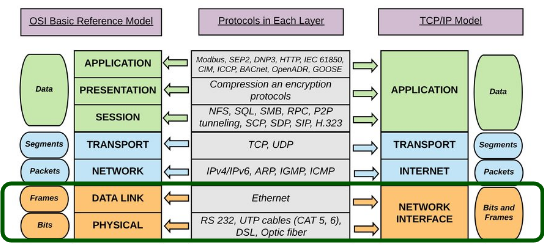
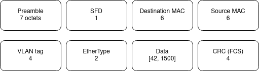

# CEH page 6 notes


# Layer 2

A layer 2 network is a broadcast domain.



Ethernet frame format is defined by the IEEE 802.3 standard: 
[https://fr.wikipedia.org/wiki/IEEE_802.3](https://fr.wikipedia.org/wiki/IEEE_802.3)

Wikipedia: 
[https://en.wikipedia.org/wiki/Ethernet_frame](https://en.wikipedia.org/wiki/Ethernet_frame)

## Example using [scapy](https://github.com/secdev/scapy/)

`ifconfig -a` provides own MAC address.

`sudo nmap -sS 192.168.0/24` also returns the MAC addresses .TCP SYN (Stealth) Scan (-sS) is the default TCP scan when run as root [nmap book](https://nmap.org/book/synscan.html)


On kali:
```
sudo ./run_scapy 
x = Ether(src='d8:cb:8a:84:06:8c', dst='b8:27:eb:13:dc:9f')
ls(x)
sendp(x, iface='eth0')
```

On rapsberry pi...
tcpdump documentation:
```
-e     Print the link-level header on each dump line.  This can be used, for example, to print MAC layer addresses for protocols such as Ethernet and IEEE 802.11
-n     Don't convert addresses (i.e., host addresses, port numbers, etc.) to names.
-i interface
```
tcpdump supports the “ether” qualifier to specify ethernet addresses in the standard colon-separated format. To capture any traffic sent to or from a given MAC address :
```
tcpdump ether host e8:2a:ea:44:55:66
```
Thus we capture the frame using this command:
```
sudo tcpdump -eni eth0 ether host d8:cb:8a:84:06:8c > tcpdump.txt
```
shows:
```
12:02:24.022056 d8:cb:8a:84:06:8c > b8:27:eb:13:dc:9f, ethertype Loopback (0x9000), length 60: Loopback, skipCount 0,  invalid (0)
```


## Ethernet frame



### preamble

binary value:
```
10101010 10101010 10101010 10101010 10101010 10101010 10101010
AA AA AA AA AA AA AA
```

There is no preamble in the fields shown in Wireshark. The preamble is a physical layer mechanism to help the NIC identify the start of a frame. It carries no useful data and is not received like other fields.

### Start Frame Delimiter
```
10101011
AB
```

### destination MAC address

Some switches operate on Fast-Forward mode. They can look into their MAC address table and start forwarding frames as soon as they get the destination MAC address.

[https://www.networkacademy.io/ccna/ethernet/store-and-forward-vs-cut-through-switching](https://www.networkacademy.io/ccna/ethernet/store-and-forward-vs-cut-through-switching)

### source MAC address 

### VLAN tag

[https://fr.wikipedia.org/wiki/IEEE_802.1Q](https://fr.wikipedia.org/wiki/IEEE_802.1Q)

Switches associate each port with a vlan id (Port VLAN Identifier). Switches are responsible for creation and management of VLANs.
Default is PVID 1.
Switches can handle multiple VLANs.
[https://www.youtube.com/watch?v=vE5gvbmR8jg](https://www.youtube.com/watch?v=vE5gvbmR8jg)

* Trunk = 802.1q link, adds VLAN ID (VLAN tag) to frames traversing switches.
* trunking = passing different VLAN frames over the trunk
* Trunk port (CISCO term) = tagged port, port that adds the VLAN tag to ethernet frames
* Access port (CISCO) = untagged port, switch port that sends and expects to receive frames without VLAN tag. An access port carries traffic for a single VLAN.
* Switches remove the VLAN tag before deleivering frames to destination.


### EtherType

[https://en.wikipedia.org/wiki/EtherType](https://en.wikipedia.org/wiki/EtherType)
EtherType is a two-octet field in an Ethernet frame. It is used to indicate which protocol is encapsulated in the payload of the frame and is used at the receiving end by the data link layer to determine how the payload is processed.
[https://en.wikipedia.org/wiki/EtherType#Values](https://en.wikipedia.org/wiki/EtherType#Values)

Layer 2 header carries information about the layer 3 :
* `0x0800` corresponds to "IPv4"
* `0x0806` corresponds to "ARP"

### Data

Data is the content created by upper layers of the TCP/IP stack (including network layer, transport layer...)
The maximum size of frames is called the Maximum Transmission Unit (MTU).
The maximum payload in 802.3 ethernet is 1500 bytes. MTU is 1500 bytes.

### CRC (FCS)

Cyclic Redundancy Check (Frame Check Sequence)

## ARP


[ARP](https://en.wikipedia.org/wiki/Address_Resolution_Protocol) is not IP. ARP is layer 2.

* "Computer 1 uses a cached ARP table to look up 192.168.0.55 for any existing records of Computer 2's MAC address
* If the cache did not produce a result, computer 1 has to send a broadcast ARP request message (destination FF:FF:FF:FF:FF:FF MAC address), which is accepted by all computers on the local network, requesting an answer for 192.168.0.55.
* Computer 2 responds with an ARP response message containing its MAC and IP addresses. As part of fielding the request, Computer 2 may insert an entry for Computer 1 into its ARP table for future use.
* Computer 1 receives and caches the response information in its ARP table and can now send the packet"

"ARP packets are not routable nor do they have IP headers. ARP is a broadcast frame that is sent on a layer 2 segment. ARP has no protocol number and has type `0x806`, which all lends itself to L2.
Ultimately ARP operates only at L2 but provides services to L3." [src](https://gregsowell.com/?p=2987)

One could say that ARP provides services to L2: if computer 1 has to send a frame to computer 2, then computer 1 needs computer 2 MAC address.

scapy:
* psrc is Sender protocol address (SPA)
* pdst is Target protocol address (TPA)
* hwsrc is Target hardware address (THA)
[https://en.wikipedia.org/wiki/Address_Resolution_Protocol](https://en.wikipedia.org/wiki/Address_Resolution_Protocol)


this sends ARP request to broadcast MAC address:
```
result = sr1(ARP(op="who-has", psrc="192.168.0.35", pdst="192.168.0.31"))
```


`result` returns the correct MAC address `b8:27:eb:13:dc:9f`:
```
<ARP  hwtype=0x1 ptype=IPv4 hwlen=6 plen=4 op=is-at hwsrc=b8:27:eb:13:dc:9f psrc=192.168.0.31 hwdst=d8:cb:8a:84:06:8c pdst=192.168.0.35 |<Padding  load='\x00\x00\x00\x00\x00\x00\x00\x00\x00\x00\x00\x00\x00\x00\x00\x00\x00\x00' |>>
```


A host will send a ARP request only to query IP address from the same network.
For example, no broadcast ARP request will be sent to query Google DNS server 8.8.8.8.
For any IP address not in the LAN, hosts use the MAC address of the default gateway. In above example:
* 192.168.0.22
* 00:24:d4:79:ae:06

### ARP cache poisoning and MITM

[https://medium.datadriveninvestor.com/arp-cache-poisoning-using-scapy-d6711ecbe112](https://medium.datadriveninvestor.com/arp-cache-poisoning-using-scapy-d6711ecbe112)

[https://www.ettercap-project.org/](https://www.ettercap-project.org/)

[https://www.hackers-arise.com/post/2017/08/28/mitm-attack-with-ettercap](https://www.hackers-arise.com/post/2017/08/28/mitm-attack-with-ettercap)

# Layer 3


## IP V4


Does class A IP adresses include 0.* and 127.* ?
* A, 1.0.0.0 - 126.255.255.255, 0XXXXXXX, 255.0.0.0
* B, 128.0.0.0 - 191.255.255.255, 10XXXXXX, 255.255.0.0
* C, 192.0.0.0 - 223.255.255.255, 110XXXXX, 255.255.255.0
* ...

All devices from the same switched network (L2) must have IP addresses from the same network. 
Every IP address that belongs to a network has:
* a network part
* a host part
Parts are defined by the network mask

A layer 3 network is a set of devices that can talk to each other without going through a gateway.

### private IP addresses ranges

* 1 class A network, 10.0.0.0 - 10.255.255.255, (starting from 10.0.0.0/8 network)
* 16 class B networks, 172.16.0.0 - 172.31.255.255, (starting from 172.16.0.0/16 network)
* 256 class C networks, 192.168.0.0 - 192.168.255.255, (starting from 192.168.0.0/24 network)

### header


[https://en.wikipedia.org/wiki/IPv4#Header](https://en.wikipedia.org/wiki/IPv4#Header)

*packet splitting*

IPV4 packet size is [20, 65 535] bytes.
But ethernet frames MTU is 1500 bytes.
When a router receives a packet, it examines the destination address and determines the outgoing interface to use and that interface's MTU. If the packet size is bigger than the MTU, then the router fragments the packet.
Large packets are splitted into smaller packets.
[https://en.wikipedia.org/wiki/IPv4#Fragmentation_and_reassembly](https://en.wikipedia.org/wiki/IPv4#Fragmentation_and_reassembly)

"If 2000-byte Ethernet packets arrive at a router, it will split their payloads in two and repackage them into two packets that are each smaller than 1500 bytes and so meet the MTU.
An alternative is that the router drops the packet but sends the source device an internet control-message protocol (ICMP) packet-too-big message. The intent is for the source device resend the payload in smaller packets, but it might not be configured to support this."

"IP specifies that an ICMP error message type 3 (destination unreachable) code 4 (Fragmentation Required but DF Bit Is Set) is sent to the originating host at the point where the fragmentation would have occurred"

*The fragment offset field* specifies the offset of a particular fragment relative to the beginning of the original unfragmented IP datagram in units of eight-byte blocks. The first fragment has an offset of zero. The 13 bit field allows a maximum offset of (2^13 – 1) × 8 = 65,528 bytes, which, with the header length included (65,528 + 20 = 65,548 bytes), supports fragmentation of packets exceeding the maximum IP length of 65,535 bytes.

*Version*
"4" for IPV4

*IHL*
Internet Header Length. Minimum length is 160bits (if no options).

*DSCP*
Differentiated Service Code Point. Used to prioritize packets.

*ECN*
Explicit Congestion Notification. End-to-end notification of network congestion without dropping packets. 

*Total length* of entire IPV4 packet. From 20 bytes (only minimal header) to 65 535 bytes (maximum packet size)

*Identification*, *flag* and *fragment offset* are used for a common purpose: packet splitting. They are used by the receiver to gather all fragments of the packet.s
Packets may be splitted into *fragments*, each of them being part of the same original packet.
*indentification* field contains the unique identifier of the packet, same in all fragments. 
The *flag* field says wether the packet was fragmented or not.
The *fragment offset* field is the sequence number of each fragment (starting with 0).

*TTL* prevents infinite routing loops. Each router decrements TTL field by 1.

The *protocol* field defines the protocol used in the data portion of the IP datagram.
This can be any of [those values](https://en.wikipedia.org/wiki/List_of_IP_protocol_numbers)
For example `0x06` corresponds to TCP. 
This means that this layer 3 header carries information about the layer 4.

*Header checksum* is not the checksum of the full packet (or fragment). But only the header checksum.
Every router decrements the TTL thus recalculates the header checksum.

*Source IPV4 address*

*Destination IPV4 address*

## ICMP

Internet Control Message Protocol
```
p = IP(dst="8.8.8.8")/ICMP()
r = sr1(p)
```
Request:


Response:


## Gateway vs router

[https://www.router-switch.com/faq/gateway-router-difference.html](https://www.router-switch.com/faq/gateway-router-difference.html)

Any host in any network knows its default router or default gateway. ()

# Recap: OSI model and common protocols


